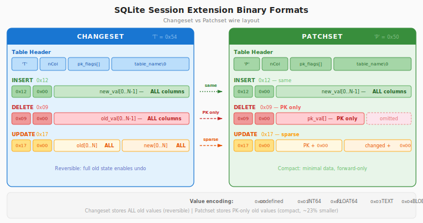

# sqlite-diff-rs

A Rust library for building SQLite [changeset and patchset](https://www.sqlite.org/sessionintro.html) binary formats programmatically.

## Overview

SQLite's [session extension](https://www.sqlite.org/session.html) provides a powerful mechanism for tracking and applying database changes. This crate enables you to **construct changeset/patchset binary data without requiring SQLite** — useful for:

- **Offline sync**: Build changesets on a server to apply to client SQLite databases
- **Testing**: Generate test fixtures for changeset processing code
- **CDC pipelines**: Produce the binary input for `sqlite3_changeset_apply()` from your own change events

## Binary Format Reference

  

Both formats share the same container structure: one or more *table sections*,
each with a table header followed by change records. The key difference is how
much old-row data each operation carries.

**Changesets** (`'T'` / `0x54`) store the complete old state of every column,
making them **reversible** — INSERTs can be turned into DELETEs and vice-versa.

**Patchsets** (`'P'` / `0x50`) omit old values for non-PK columns, producing
a **smaller, forward-only** encoding that cannot be reversed.

| Aspect | Changeset (`'T'`) | Patchset (`'P'`) |
|--------|-------------------|------------------|
| INSERT | All column values | All column values |
| DELETE | All old column values | PK values only |
| UPDATE old | All old column values | PK values + Undefined for non-PK |
| UPDATE new | All new column values | All new column values |
| Reversible | ✅ Yes | ❌ No |
| Wire size | Larger (carries full old state) | Smaller (omits non-PK old values) |

> See the [SQLite session extension docs](https://www.sqlite.org/session.html)
> for the full specification.

## License

MIT License — see [LICENSE](LICENSE) for details.
