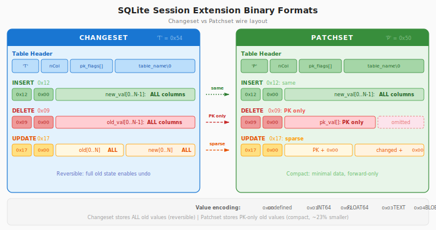

# sqlite-diff-rs

[](https://crates.io/crates/sqlite-diff-rs)
[](https://docs.rs/sqlite-diff-rs)
[](https://github.com/LucaCappelletti94/sqlite-diff-rs/actions/workflows/ci.yml)
[](https://github.com/LucaCappelletti94/sqlite-diff-rs/actions/workflows/asan.yml)
[](https://codecov.io/gh/LucaCappelletti94/sqlite-diff-rs)
[](https://github.com/LucaCappelletti94/sqlite-diff-rs/blob/main/LICENSE)

A Rust library for building SQLite [changeset and patchset](https://www.sqlite.org/sessionintro.html) binary formats programmatically.

## Overview

SQLite's [session extension](https://www.sqlite.org/session.html) defines a binary format for tracking and applying database changes. This crate constructs that binary data without linking SQLite, which is useful for offline sync (build a changeset on a server and apply it on a SQLite client), CDC pipelines (produce the input expected by `sqlite3_changeset_apply()` from your own change events), cross-database sync (convert PostgreSQL change streams from wal2json or Maxwell into the SQLite format), and generating test fixtures for changeset processing code.

This crate is not the SQLite [`sqldiff`](https://sqlite.org/sqldiff.html) tool, which compares two existing database files. This library constructs the changeset and patchset binary format programmatically from your own change data.

## Installation

Add to your `Cargo.toml`:

```toml
[dependencies]
sqlite-diff-rs = "0.2"
```

## Quick Start

```rust
use sqlite_diff_rs::{DiffOps, Insert, PatchSet, SimpleTable};

// Define a table schema: "users" with columns (id, name), PK at index 0
let users = SimpleTable::new("users", &["id", "name"], &[0]);

// Build a patchset with an INSERT
let patchset = PatchSet::<_, String, Vec<u8>>::new()
    .insert(
        Insert::from(users)
            .set(0, 1i64).unwrap()      // id = 1
            .set(1, "Alice").unwrap()   // name = "Alice"
    );

// Encode to binary format
let bytes: Vec<u8> = patchset.into();

// Apply with sqlite3_changeset_apply() or sqlite3session_patchset_apply()
```

### Schema-aware CDC ingest (0.2.0+)

`builder.digest(&event, &schema, &adapter)` folds one wire event (from `pg_walstream`, `wal2json`, or `maxwell`) into a builder. Same call site for every source.

```rust,ignore
let patchset = PatchSet::<UsersTable, String, Vec<u8>>::new()
    .digest(&msg, &schema, &types)?;
let bytes: Vec<u8> = patchset.build();
```

The schema type implements `WireSchema` and its tables implement `WireColumnTypes`, declaring each column's semantic `WireType`. `TypeMap::defaults()` ships with mappings for bool, integers, reals, text, bytea, UUID, decimals, temporals, and JSON.

## Features

| Feature | Description |
|---------|-------------|
| `testing` | Enables `rusqlite` integration for differential testing |
| `wal2json` | Parse PostgreSQL wal2json output into changesets |
| `pg-walstream` | Integration with `pg_walstream` crate |
| `maxwell` | Parse Maxwell CDC JSON events |
| `diesel` | Execute patchsets as backend-generic Diesel queries via a downstream [`Adapter`] |

Enable features in `Cargo.toml`:

```toml
[dependencies]
sqlite-diff-rs = { version = "0.4", features = ["wal2json"] }
```

## Binary Format Reference

<p align="center">
  
</p>

Both formats share the same container structure: one or more table sections, each with a table header followed by change records. The key difference is how much old-row data each operation carries.

Changesets (`'T'` / `0x54`) store the complete old state of every column. This makes them reversible, so INSERTs can be turned into DELETEs and vice versa.

Patchsets (`'P'` / `0x50`) omit old values for non-PK columns, producing a smaller, forward-only encoding that cannot be reversed.

| Aspect | Changeset (`'T'`) | Patchset (`'P'`) |
|--------|-------------------|------------------|
| INSERT | All column values | All column values |
| DELETE | All old column values | PK values only |
| UPDATE old | All old column values | PK values + Undefined for non-PK |
| UPDATE new | All new column values | All new column values |
| Reversible | Yes | No |
| Wire size | Larger (carries full old state) | Smaller (omits non-PK old values) |

See the [SQLite session extension docs](https://www.sqlite.org/session.html) for the full specification.

## Apply diffs with Diesel

The `diesel` feature turns each op of a `PatchSet` or `ChangeSet` into a backend-generic Diesel query. Downstream implements one `Adapter` per schema (the set of tables), and it maps `(table_name, column_index)` pairs to column identifiers and to per-column `Binder`s. Each `Binder` calls `push_bind_param` with the target `SqlType` the column expects, so values travel as native binary binds and the emitted SQL contains no `CAST` wrappers regardless of backend. The `ApplyOps` extension trait wraps the batch-execute and `conn.transaction` shapes so a full apply reads as one call. A `ChangeSet` additionally renders primary-key changes, including composite keys, because it carries both the old and the new value of every column. A `PatchSet` stores no new primary-key value, so those updates are changeset-only.

```rust,ignore
use diesel::pg::Pg;
use diesel::prelude::*;
use diesel::query_builder::AstPass;
use diesel::result::QueryResult;
use diesel::sql_types::Bool;
use sqlite_diff_rs::{
    Adapter, ApplyOps, Binder, DefaultBinder, DiffOps, Insert, PatchSet, SimpleTable, Value,
};

// A binder for target BOOLEAN columns. Native SQL type, no CAST.
struct BoolBinder(bool);
impl Binder<Pg> for BoolBinder {
    fn walk<'b>(&'b self, out: &mut AstPass<'_, 'b, Pg>) -> QueryResult<()> {
        out.push_bind_param::<Bool, bool>(&self.0)
    }
}

// One adapter per schema, dispatching on (table_name, column_index).
struct MyAdapter;
impl<S: AsRef<str> + Sync, B: AsRef<[u8]> + Sync> Adapter<Pg, S, B> for MyAdapter {
    fn column_name(&self, _table: &str, index: usize) -> &str {
        ["id", "active"][index]
    }
    fn bind<'a>(
        &self,
        table: &str,
        column_index: usize,
        value: &'a Value<S, B>,
    ) -> diesel::result::QueryResult<Box<dyn Binder<Pg> + Send + 'a>> {
        match (table, column_index, value) {
            ("users", 1, Value::Integer(v)) => Ok(Box::new(BoolBinder(*v != 0))),
            _ => Ok(Box::new(DefaultBinder::from(value))),
        }
    }
}

let schema = SimpleTable::new("users", &["id", "active"], &[0]);
let patchset = PatchSet::<SimpleTable, String, Vec<u8>>::new().insert(
    Insert::from(schema.clone())
        .set(0, 1_i64)
        .unwrap()
        .set(1, 1_i64)
        .unwrap(),
);

let mut conn = PgConnection::establish("postgres://...")?;
patchset
    .iter()
    .map(|op| op.with_adapter::<Pg, _>(&MyAdapter))
    .apply_transactional(&mut conn)?;
# Ok::<_, diesel::result::Error>(())
```

Enable via `Cargo.toml`:

```toml
[dependencies]
sqlite-diff-rs = { version = "0.1", features = ["diesel"] }
diesel = { version = "2", features = ["postgres"] }
```

End-to-end tests against real SQLite, Postgres, and MySQL containers live under [`integration-tests/diesel-e2e/`](integration-tests/diesel-e2e/). The unit test files [`tests/diesel_patchset.rs`](tests/diesel_patchset.rs) and [`tests/diesel_changeset.rs`](tests/diesel_changeset.rs) hold fully runnable versions of the example above and of the changeset primary-key cases.

## `no_std` Support

This crate is `no_std` compatible (requires `alloc`). It can be used in embedded or WebAssembly environments.

## License

MIT License, see [LICENSE](https://github.com/LucaCappelletti94/sqlite-diff-rs/blob/main/LICENSE) for details.
