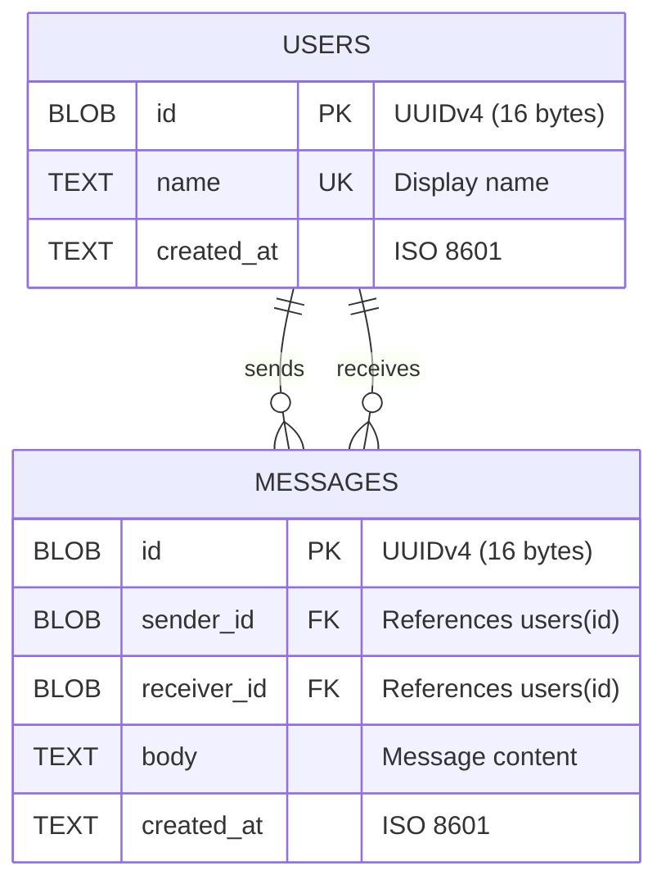
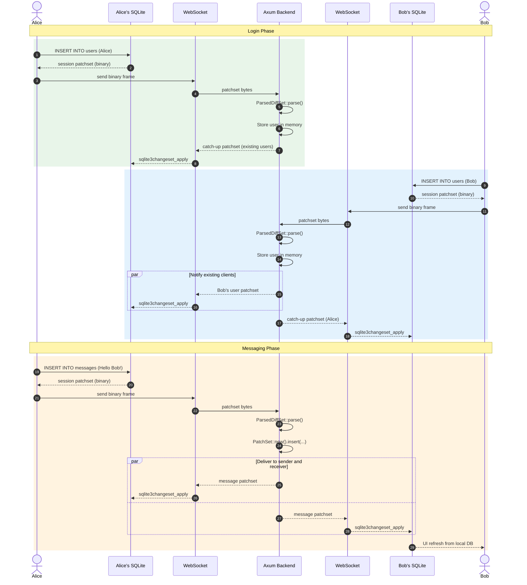

# Integration Tests — Chat Application

End-to-end integration tests for **sqlite-diff-rs** using a real-time chat application.
Every piece of data that crosses the wire is a raw binary **patchset** —
the same format produced by SQLite's session extension and by `sqlite-diff-rs` builders.

| Crate | Role |
|---|---|
| **chat-shared** | `no_std` DDL constants + `TableSchema` definitions shared by both sides |
| **chat-backend** | Axum WebSocket server — parses inbound patchsets with `ParsedDiffSet::parse`, builds outbound ones with `PatchSet` |
| **chat-frontend** | Yew SPA — captures writes via `sqlite3session_patchset` (sqlite-wasm-rs FFI), applies incoming data via `sqlite3changeset_apply` |

---

## Database Schema



Primary keys are **UUIDv4** values stored as 16-byte BLOBs, generated client-side
(`uuid` crate with `v4` + `js` features on wasm, plain `v4` on the backend).
The same schema is initialised identically on every frontend SQLite instance and
mirrored in the backend's in-memory state.

---

## Message Stream / User Experience



Every WebSocket frame is a **raw binary patchset** — no JSON, no envelopes, no
structured message types. The backend decides what to do by inspecting the table
name and operation inside the parsed patchset.

---

## Quick Start (Docker)

```bash
cd integration-tests

# Run the integration tests — single command:
docker compose run --rm test

# Or launch the full chat app for manual testing:
docker compose up app
# Then open http://localhost:3000 in two browser tabs.
```

The `test` service builds the workspace inside the container and runs the
backend integration tests end-to-end (ephemeral Axum servers, real WebSocket
clients exchanging binary patchsets). No local toolchain required.

The `app` service builds the Yew WASM bundle with Trunk at image-build time,
then runs a single Axum server that serves both the static frontend and the
`/ws` WebSocket endpoint on port **3000**.

### VS Code Integration

The workspace includes `.vscode/settings.json` and `.vscode/tasks.json` for
seamless port-forwarding and one-click tasks:

| Task | Description |
|---|---|
| **integration-tests: docker compose up** | Build & start the app |
| **integration-tests: run tests** | Run integration tests (default test task) |
| **integration-tests: docker compose down** | Stop and remove containers |

Open the Command Palette → **Tasks: Run Task** to use them.
`remote.portsAttributes` ensures port 3000 is auto-forwarded and opened in
your browser when working over Remote SSH, WSL, or Codespaces.

---

## Manual Setup

### Prerequisites

| Tool | Version | Install |
|---|---|---|
| **Rust** | nightly (edition 2024) | `rustup default nightly` |
| **wasm32 target** | — | `rustup target add wasm32-unknown-unknown` |
| **Trunk** | ≥ 0.21 | `cargo install trunk` |
| **wasm-bindgen-cli** | matches `wasm-bindgen` dep | `cargo install wasm-bindgen-cli` |

> The frontend crate depends on `sqlite-wasm-rs` which only compiles for
> `wasm32-unknown-unknown`. Native `cargo check` of `chat-frontend` must
> pass `--target wasm32-unknown-unknown`.

### 1 — Check all crates compile

```bash
# From the repository root
cargo check -p chat-shared
cargo check -p chat-backend --tests
cargo check -p chat-frontend --target wasm32-unknown-unknown
```

### 2 — Run backend integration tests

```bash
cargo test -p chat-backend
```

This starts an ephemeral Axum server per test using `chat_backend::serve()` on a
random port, connects WebSocket clients via `tokio-tungstenite`, and exchanges
real binary patchsets end-to-end.

| Test | What it verifies |
|---|---|
| `test_two_users_exchange_messages` | Two users log in, exchange messages; both receive the correct patchsets that parse via `ParsedDiffSet::parse` |
| `test_user_does_not_receive_others_messages` | A message from Alice→Bob is **not** delivered to Eve |

### 3 — Run frontend browser tests

```bash
cd integration-tests/frontend
wasm-pack test --headless --chrome   # or --firefox
```

These run inside a real browser via `wasm-bindgen-test` and exercise the
`sqlite-wasm-rs` FFI (session create → attach → patchset → apply) against
`sqlite-diff-rs` builders.

| Test | What it verifies |
|---|---|
| `test_session_capture_and_apply` | Round-trip: INSERT → session patchset → `ParsedDiffSet::parse` → apply to second DB |
| `test_multi_insert_session` | Multi-table session (2 users + 1 message) in a single patchset |
| `test_builder_patchset_apply` | `sqlite-diff-rs` builder output → `sqlite3changeset_apply` |
| `test_builder_vs_session_roundtrip` | Builder-built and session-captured patchsets for identical INSERTs both parse and apply equivalently |

### 4 — Run the full application locally

**Terminal 1 — Build the frontend:**

```bash
cd integration-tests/frontend
trunk build
# Output goes to dist/
```

**Terminal 2 — Run the backend (serves both API + static files):**

```bash
RUST_LOG=info STATIC_DIR=integration-tests/frontend/dist cargo run -p chat-backend
# Listening on 0.0.0.0:3000
```

Open two browser tabs at `http://127.0.0.1:3000`, log in with different names,
and send messages. Every write is captured as a session patchset, sent over
WebSocket as raw bytes, and applied to the other tab's local SQLite via
`sqlite3changeset_apply`.

---

## Project Structure

```
integration-tests/
├── docker-compose.yml         # Single-command test & deploy
├── Dockerfile                 # Multi-stage (test / backend / frontend)
├── Dockerfile.dockerignore
├── shared/                    # no_std shared types
│   └── src/
│       ├── ddl.rs             # DDL + TableSchema definitions
│       ├── schema.rs          # Column-index constants
│       └── lib.rs
├── backend/                   # Axum server
│   └── src/
│       ├── lib.rs             # Library entry (re-exports for tests)
│       ├── main.rs            # Binary entry
│       ├── state.rs           # In-memory AppState (users, messages, clients)
│       └── ws.rs              # WebSocket handler (parse ↔ build patchsets)
│   └── tests/
│       └── ws_integration.rs  # tokio-tungstenite end-to-end tests
├── frontend/                  # Yew SPA (wasm32)
│   ├── index.html             # Trunk entry point (Tailwind CDN)
│   ├── Trunk.toml
│   └── src/
│       ├── main.rs            # Yew App component (login + chat UI)
│       ├── db.rs              # LocalDb — raw sqlite3 FFI wrapper
│       ├── session.rs         # capture_patchset / apply_patchset FFI
│       └── websocket.rs       # Browser WebSocket via web-sys
│   └── tests/
│       └── wasm.rs            # wasm-bindgen-test browser tests
└── README.md                  # ← you are here
```
