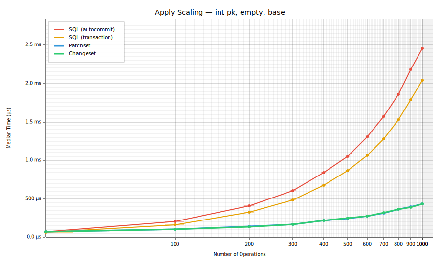
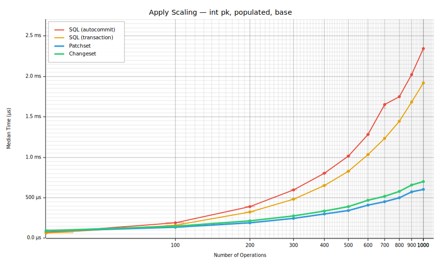
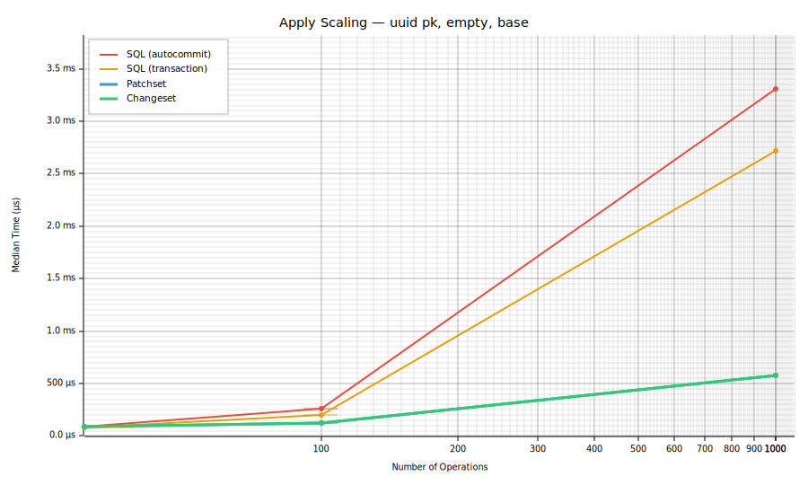
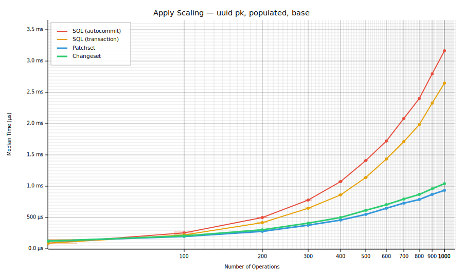
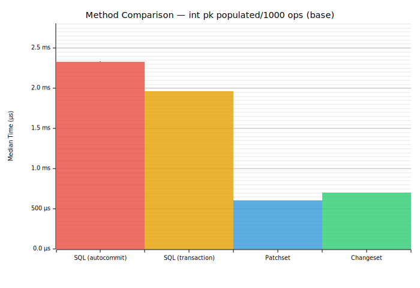
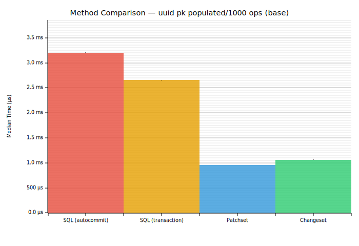
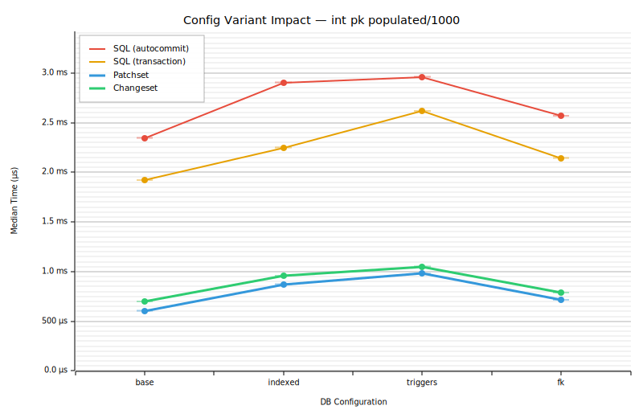
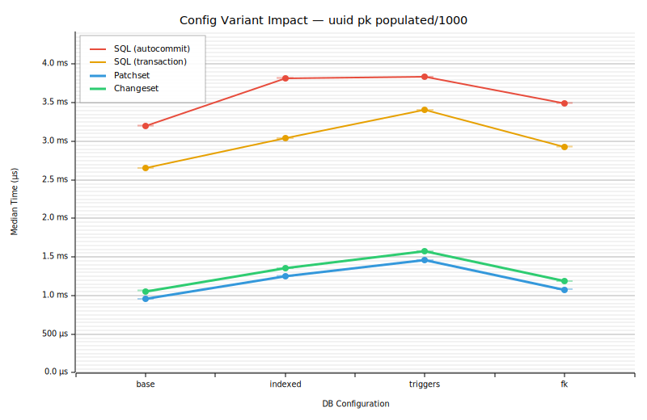
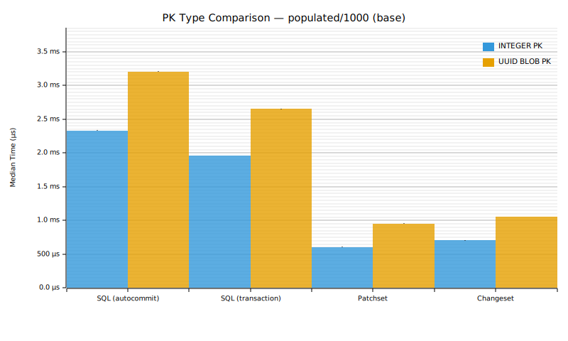

# Apply Benchmark Report

## Methodology

This report compares four methods for applying changes to an SQLite database:

| Method | Description |
|--------|-------------|
| **SQL (autocommit)** | Execute raw SQL statements one at a time (implicit autocommit) |
| **SQL (transaction)** | Same SQL wrapped in a single `BEGIN…COMMIT` transaction |
| **Patchset** | Apply a binary patchset via `conn.apply_strm()` |
| **Changeset** | Apply a binary changeset via `conn.apply_strm()` |

All times are from Criterion.rs (95% confidence level). Median is used as the primary metric. Benchmarks run on in-memory SQLite databases.

## Summary Table

| PK Type | State | Ops | Config | SQL (autocommit) | SQL (transaction) | Patchset | Changeset |
|---------|-------|-----|--------|------|------|------|------|
| int_pk | empty | 30 | base | 76.0 µs ± 0.7 µs | **64.8 µs ± 0.6 µs** | 71.1 µs ± 1.4 µs | 71.5 µs ± 0.7 µs |
| int_pk | empty | 100 | base | 205.4 µs ± 1.3 µs | 165.2 µs ± 1.9 µs | **103.5 µs ± 0.7 µs** | 103.6 µs ± 0.7 µs |
| int_pk | empty | 200 | base | 411.2 µs ± 3.4 µs | 328.1 µs ± 2.1 µs | 140.0 µs ± 1.4 µs | **139.1 µs ± 1.3 µs** |
| int_pk | empty | 300 | base | 608.9 µs ± 2.6 µs | 484.5 µs ± 3.5 µs | **169.8 µs ± 1.7 µs** | 170.8 µs ± 1.3 µs |
| int_pk | empty | 400 | base | 841.5 µs ± 7.8 µs | 673.9 µs ± 7.1 µs | 221.7 µs ± 2.2 µs | **221.5 µs ± 2.5 µs** |
| int_pk | empty | 500 | base | 1.06 ms ± 9.1 µs | 870.2 µs ± 7.1 µs | **246.4 µs ± 3.9 µs** | 248.5 µs ± 2.2 µs |
| int_pk | empty | 600 | base | 1.30 ms ± 12.4 µs | 1.06 ms ± 8.2 µs | 278.6 µs ± 2.1 µs | **277.2 µs ± 2.0 µs** |
| int_pk | empty | 700 | base | 1.57 ms ± 9.3 µs | 1.28 ms ± 8.0 µs | **313.6 µs ± 6.7 µs** | 319.0 µs ± 2.3 µs |
| int_pk | empty | 800 | base | 1.86 ms ± 10.4 µs | 1.53 ms ± 8.8 µs | **365.0 µs ± 3.0 µs** | 366.2 µs ± 2.9 µs |
| int_pk | empty | 900 | base | 2.18 ms ± 13.7 µs | 1.79 ms ± 18.3 µs | 394.9 µs ± 4.4 µs | **388.4 µs ± 2.7 µs** |
| int_pk | empty | 1000 | base | 2.46 ms ± 27.9 µs | 2.05 ms ± 19.3 µs | 435.0 µs ± 2.6 µs | **434.1 µs ± 3.3 µs** |
| int_pk | populated | 30 | base | 69.3 µs ± 116.5 µs | **65.2 µs ± 57.6 µs** | 88.1 µs ± 16.0 µs | 94.1 µs ± 13.6 µs |
| int_pk | populated | 100 | base | 188.5 µs ± 1.6 µs | 161.3 µs ± 1.7 µs | **133.7 µs ± 1.8 µs** | 149.6 µs ± 3.2 µs |
| int_pk | populated | 200 | base | 392.5 µs ± 3.2 µs | 323.8 µs ± 2.4 µs | **192.4 µs ± 2.4 µs** | 213.1 µs ± 8.0 µs |
| int_pk | populated | 300 | base | 598.7 µs ± 15.3 µs | 483.9 µs ± 3.2 µs | **246.3 µs ± 2.5 µs** | 276.6 µs ± 3.0 µs |
| int_pk | populated | 400 | base | 804.8 µs ± 4.5 µs | 650.5 µs ± 9.4 µs | **297.8 µs ± 2.6 µs** | 338.7 µs ± 3.7 µs |
| int_pk | populated | 500 | base | 1.02 ms ± 8.9 µs | 827.1 µs ± 3.9 µs | **340.3 µs ± 5.3 µs** | 389.7 µs ± 8.2 µs |
| int_pk | populated | 600 | base | 1.28 ms ± 7.0 µs | 1.03 ms ± 9.6 µs | **408.3 µs ± 3.7 µs** | 467.9 µs ± 3.6 µs |
| int_pk | populated | 700 | base | 1.65 ms ± 82.3 µs | 1.23 ms ± 19.2 µs | **453.3 µs ± 6.6 µs** | 515.3 µs ± 9.4 µs |
| int_pk | populated | 800 | base | 1.75 ms ± 14.9 µs | 1.44 ms ± 8.9 µs | **502.2 µs ± 4.0 µs** | 576.6 µs ± 5.4 µs |
| int_pk | populated | 900 | base | 2.02 ms ± 16.5 µs | 1.68 ms ± 13.1 µs | **569.8 µs ± 5.2 µs** | 659.6 µs ± 9.8 µs |
| int_pk | populated | 1000 | base | 2.35 ms ± 14.9 µs | 1.92 ms ± 9.0 µs | **605.7 µs ± 6.8 µs** | 698.6 µs ± 4.7 µs |
| int_pk | populated | 1000 | fk | 2.57 ms ± 16.8 µs | 2.14 ms ± 14.6 µs | **715.7 µs ± 3.9 µs** | 790.1 µs ± 5.8 µs |
| int_pk | populated | 1000 | indexed | 2.90 ms ± 20.3 µs | 2.24 ms ± 18.4 µs | **872.3 µs ± 4.3 µs** | 955.8 µs ± 4.0 µs |
| int_pk | populated | 1000 | triggers | 2.96 ms ± 20.4 µs | 2.61 ms ± 13.8 µs | **980.4 µs ± 9.9 µs** | 1.05 ms ± 11.4 µs |
| uuid_pk | empty | 30 | base | 91.9 µs ± 0.8 µs | **77.6 µs ± 2.5 µs** | 89.5 µs ± 0.9 µs | 89.6 µs ± 0.7 µs |
| uuid_pk | empty | 100 | base | 250.5 µs ± 2.6 µs | 197.5 µs ± 1.7 µs | **125.3 µs ± 1.1 µs** | 125.7 µs ± 2.2 µs |
| uuid_pk | empty | 200 | base | 497.0 µs ± 10.9 µs | 391.3 µs ± 3.4 µs | **166.5 µs ± 1.9 µs** | 167.2 µs ± 1.3 µs |
| uuid_pk | empty | 300 | base | 759.7 µs ± 7.8 µs | 603.6 µs ± 5.4 µs | 221.1 µs ± 1.4 µs | **219.9 µs ± 1.6 µs** |
| uuid_pk | empty | 400 | base | 1.05 ms ± 6.9 µs | 831.3 µs ± 11.5 µs | 263.3 µs ± 1.8 µs | **261.8 µs ± 1.8 µs** |
| uuid_pk | empty | 500 | base | 1.37 ms ± 14.3 µs | 1.12 ms ± 13.7 µs | 322.5 µs ± 2.4 µs | **321.3 µs ± 2.9 µs** |
| uuid_pk | empty | 600 | base | 1.73 ms ± 14.9 µs | 1.40 ms ± 11.5 µs | **360.5 µs ± 2.7 µs** | 360.7 µs ± 3.2 µs |
| uuid_pk | empty | 700 | base | 2.06 ms ± 18.5 µs | 1.68 ms ± 13.9 µs | 415.7 µs ± 3.0 µs | **413.5 µs ± 2.8 µs** |
| uuid_pk | empty | 800 | base | 2.44 ms ± 20.4 µs | 2.02 ms ± 9.8 µs | 464.1 µs ± 3.3 µs | **462.8 µs ± 3.4 µs** |
| uuid_pk | empty | 900 | base | 2.86 ms ± 17.3 µs | 2.38 ms ± 9.5 µs | **517.0 µs ± 6.2 µs** | 523.6 µs ± 4.7 µs |
| uuid_pk | empty | 1000 | base | 3.28 ms ± 26.0 µs | 2.73 ms ± 5.4 µs | 574.1 µs ± 2.8 µs | **567.3 µs ± 5.2 µs** |
| uuid_pk | populated | 30 | base | 96.0 µs ± 182.0 µs | **91.0 µs ± 172.8 µs** | 125.4 µs ± 27.5 µs | 128.9 µs ± 30.3 µs |
| uuid_pk | populated | 100 | base | 256.9 µs ± 38.6 µs | 225.7 µs ± 28.4 µs | **196.9 µs ± 22.7 µs** | 210.0 µs ± 50.2 µs |
| uuid_pk | populated | 200 | base | 502.0 µs ± 5.5 µs | 423.7 µs ± 5.0 µs | **281.1 µs ± 5.7 µs** | 307.2 µs ± 4.2 µs |
| uuid_pk | populated | 300 | base | 779.9 µs ± 9.0 µs | 654.7 µs ± 9.4 µs | **377.3 µs ± 6.1 µs** | 415.6 µs ± 5.1 µs |
| uuid_pk | populated | 400 | base | 1.08 ms ± 8.2 µs | 865.5 µs ± 6.1 µs | **459.3 µs ± 5.9 µs** | 503.4 µs ± 3.7 µs |
| uuid_pk | populated | 500 | base | 1.41 ms ± 8.6 µs | 1.14 ms ± 7.9 µs | **550.9 µs ± 6.0 µs** | 614.6 µs ± 5.8 µs |
| uuid_pk | populated | 600 | base | 1.72 ms ± 12.2 µs | 1.43 ms ± 9.3 µs | **646.9 µs ± 5.2 µs** | 711.4 µs ± 5.6 µs |
| uuid_pk | populated | 700 | base | 2.08 ms ± 14.3 µs | 1.71 ms ± 9.5 µs | **731.4 µs ± 5.1 µs** | 798.9 µs ± 7.4 µs |
| uuid_pk | populated | 800 | base | 2.40 ms ± 18.4 µs | 1.98 ms ± 15.4 µs | **788.1 µs ± 4.6 µs** | 872.8 µs ± 7.5 µs |
| uuid_pk | populated | 900 | base | 2.80 ms ± 17.6 µs | 2.33 ms ± 19.3 µs | **873.7 µs ± 8.4 µs** | 959.4 µs ± 6.6 µs |
| uuid_pk | populated | 1000 | base | 3.16 ms ± 21.4 µs | 2.65 ms ± 28.2 µs | **938.4 µs ± 7.4 µs** | 1.04 ms ± 9.7 µs |
| uuid_pk | populated | 1000 | fk | 3.43 ms ± 16.6 µs | 2.90 ms ± 25.5 µs | **1.07 ms ± 34.3 µs** | 1.16 ms ± 6.3 µs |
| uuid_pk | populated | 1000 | indexed | 3.83 ms ± 7.2 µs | 3.03 ms ± 24.1 µs | **1.25 ms ± 8.2 µs** | 1.36 ms ± 7.8 µs |
| uuid_pk | populated | 1000 | triggers | 3.80 ms ± 32.7 µs | 3.36 ms ± 37.6 µs | **1.46 ms ± 6.0 µs** | 1.58 ms ± 17.0 µs |

## Scaling Analysis

How each apply method scales as the number of operations increases (30 → 100 → 1000).

### int pk, empty

### int pk, populated

### uuid pk, empty

### uuid pk, populated

## Method Comparison (populated/1000, base config)

### int pk

| Method | Median | Speedup vs SQL (autocommit) |
|--------|--------|----------------------------|
| SQL (autocommit) | 2.35 ms | 1.00× |
| SQL (transaction) | 1.92 ms | 1.22× |
| Patchset | 605.7 µs | 3.87× |
| Changeset | 698.6 µs | 3.36× |

### uuid pk

| Method | Median | Speedup vs SQL (autocommit) |
|--------|--------|----------------------------|
| SQL (autocommit) | 3.16 ms | 1.00× |
| SQL (transaction) | 2.65 ms | 1.20× |
| Patchset | 938.4 µs | 3.37× |
| Changeset | 1.04 ms | 3.03× |

## Configuration Variant Impact

How secondary indexes, triggers, and foreign keys affect apply performance (populated/1000 scenario).

### int pk

| Method | base | indexed | triggers | fk |
|--------|------|---------|----------|----|
| SQL (autocommit) | 2.35 ms | 2.90 ms (+23.6%) | 2.96 ms (+26.2%) | 2.57 ms (+9.4%) |
| SQL (transaction) | 1.92 ms | 2.24 ms (+17.0%) | 2.61 ms (+36.3%) | 2.14 ms (+11.5%) |
| Patchset | 605.7 µs | 872.3 µs (+44.0%) | 980.4 µs (+61.8%) | 715.7 µs (+18.2%) |
| Changeset | 698.6 µs | 955.8 µs (+36.8%) | 1.05 ms (+50.6%) | 790.1 µs (+13.1%) |

### uuid pk

| Method | base | indexed | triggers | fk |
|--------|------|---------|----------|----|
| SQL (autocommit) | 3.16 ms | 3.83 ms (+21.0%) | 3.80 ms (+20.2%) | 3.43 ms (+8.5%) |
| SQL (transaction) | 2.65 ms | 3.03 ms (+14.3%) | 3.36 ms (+27.0%) | 2.90 ms (+9.4%) |
| Patchset | 938.4 µs | 1.25 ms (+33.4%) | 1.46 ms (+55.1%) | 1.07 ms (+14.1%) |
| Changeset | 1.04 ms | 1.36 ms (+30.1%) | 1.58 ms (+51.1%) | 1.16 ms (+11.3%) |

## Primary Key Type Impact

Comparison of INTEGER PK vs UUID BLOB PK (populated/1000, base config).

| Method | int_pk | uuid_pk | Δ% |
|--------|--------|---------|------|
| SQL (autocommit) | 2.35 ms | 3.16 ms | +35.0% |
| SQL (transaction) | 1.92 ms | 2.65 ms | +38.0% |
| Patchset | 605.7 µs | 938.4 µs | +54.9% |
| Changeset | 698.6 µs | 1.04 ms | +49.5% |

## Generation Benchmarks

Time to generate a changeset/patchset from a database diff.

| Benchmark | Method | Median | Std Dev |
|-----------|--------|--------|---------|
| changeset_generation | rusqlite | 204.1 µs | 1.5 µs |
| changeset_generation | builder_api | 6.9 µs | 0.1 µs |
| patchset_generation | rusqlite | 205.7 µs | 1.2 µs |
| patchset_generation | builder_api | 6.5 µs | 0.0 µs |
| patchset_generation | sql_parser | 26.3 µs | 0.5 µs |

## Key Findings

- **int_pk**: Changeset apply is **3.4×** faster than autocommit SQL at 1000 ops
- **int_pk**: Patchset apply is **3.9×** faster than autocommit SQL at 1000 ops
- **int_pk**: Wrapping SQL in a transaction gives a **1.2×** speedup over autocommit
- **uuid_pk**: Changeset apply is **3.0×** faster than autocommit SQL at 1000 ops
- **uuid_pk**: Patchset apply is **3.4×** faster than autocommit SQL at 1000 ops
- **uuid_pk**: Wrapping SQL in a transaction gives a **1.2×** speedup over autocommit

