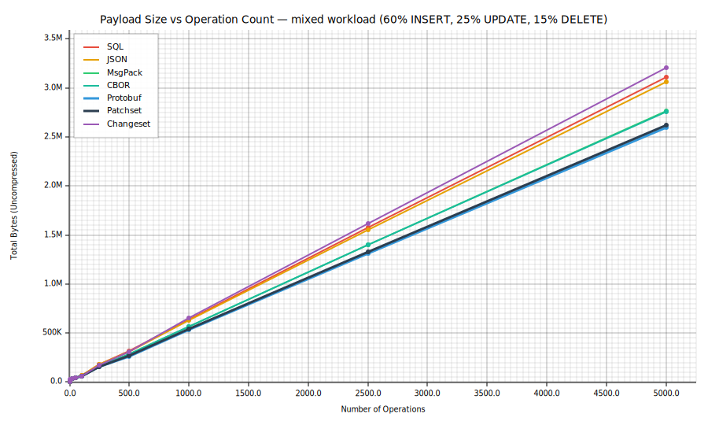

# payload-size-bench

Compares the wire size of **seven serialization formats** for identical database
operations on a realistic chat schema. Each format uses the **most natural
binary encoding it supports**, so the comparison reflects real-world usage
rather than an artificial normalization.

| Format | Field IDs | Binary ID encoding | Ecosystem |
|---|---|---|---|
| **SQL** | Column names per row | Hex `X'...'` (32 chars) | Databases |
| **JSON** | Key strings per row | Hex string (32 chars) | Web APIs |
| **MsgPack** | Key strings per row | Raw bytes (16 bytes) | WebSocket/RPC |
| **CBOR** | Key strings per row | Raw bytes (16 bytes) | IoT/COSE |
| **Protobuf** | Field numbers (1–2 B) | Raw bytes (16 bytes) | gRPC/mobile |
| **Patchset** | Positional (header once) | Raw BLOB (16 bytes) | sqlite-diff |
| **Changeset** | Positional (header once) | Raw BLOB (16 bytes) | sqlite-diff |

```
cargo run -p payload-size-bench
```

## Schema under test

```sql
CREATE TABLE messages (
    id          BLOB PRIMARY KEY,  -- 16-byte UUID
    sender_id   BLOB NOT NULL,     -- 16-byte UUID
    receiver_id BLOB NOT NULL,     -- 16-byte UUID
    body        TEXT NOT NULL,
    created_at  TEXT NOT NULL
);
```

Message bodies are drawn from 10 realistic chat strings (4–140 bytes).
UUIDs are deterministic 16-byte values.

## What it measures

The benchmark constructs **identical logical operations** in all seven formats,
then compares their serialized byte lengths. It does **not** measure CPU time —
only payload size, which directly determines network bandwidth and storage cost.

### Part 1 — Single operations

Each operation (INSERT, UPDATE, DELETE) encoded once, standalone.

### Part 2 — Overhead breakdown

For a single INSERT with a 124-byte body, shows the "raw content" (theoretical
minimum — just data bytes, zero framing) and how much overhead each format adds.

### Part 3 — Mixed workload at scale

Batches of 1–1,000 operations with a realistic mix: **60% INSERT, 25% UPDATE,
15% DELETE**. This is key because:

- **INSERTs** are identical in patchset and changeset.
- **UPDATEs** diverge: changeset stores *old + new*, patchset only *new*.
- **DELETEs** diverge: changeset stores all columns, patchset only the PK.

### Part 4 — Per-operation amortized cost

Total bytes ÷ N. Shows how fixed headers amortize to near zero at scale.

### Part 5 — Summary

Headline numbers at 1,000 operations.

## Results

### Single operations

| Operation | SQL | JSON | MsgPack | CBOR | Protobuf | Patchset | Changeset |
|---|--:|--:|--:|--:|--:|--:|--:|
| INSERT msg (4B body) | 223 | 205 | 136 | 134 | **88** | 104 | 104 |
| INSERT msg (124B body) | 343 | 325 | 257 | 255 | **209** | 224 | 224 |
| UPDATE body (4B → 40B) | 117 | 105 | 79 | 78 | **62** | 103 | 108 |
| DELETE message | 68 | 55 | 32 | 31 | **20** | 36 | 104 |

- **Protobuf wins every single operation** — field numbers instead of names
  plus raw bytes for UUIDs gives the absolute minimum per-message framing.
- MsgPack ≈ CBOR — both carry key names but use raw byte-strings for UUIDs.
- Patchset/Changeset are competitive on INSERT but pay a fixed table header
  (~16B) that hurts on small single operations.

### Per-format overhead on a single INSERT (124B body)

| | Bytes | Overhead |
|---|--:|--:|
| Raw content | 196 | — |
| SQL | 343 | +75% |
| JSON | 325 | +66% |
| MsgPack | 257 | +31% |
| CBOR | 255 | +30% |
| Protobuf | 209 | +7% |
| Patchset | 224 | +14% |
| Changeset | 224 | +14% |

Overhead sources:

- **SQL**: column names repeated per row, `X''` hex wrappers (2× blob size),
  quotes, syntax keywords.
- **JSON**: key names per row, hex-encoded blobs (2×), quotes, braces, commas.
- **MsgPack**: key names (compact binary keys), but raw byte-strings for UUIDs.
- **CBOR**: key names, raw byte-strings, no quoting. ~2 bytes less than MsgPack.
- **Protobuf**: field numbers (1–2 bytes each) instead of names, raw bytes for
  blobs, varint length prefixes. **Lowest single-message overhead.**
- **Patchset/Changeset**: table header emitted once (~16 B), then per-row cost
  is opcode + varint type tags per value.

### Mixed workload at scale (1,000 operations)

| Format | Total bytes | × raw | Overhead |
|---|--:|--:|--:|
| Raw content | 91,430 | 1.0× | — |
| SQL | 203,979 | 2.2× | +123% |
| JSON | 187,931 | 2.1× | +106% |
| MsgPack | 136,003 | 1.5× | +49% |
| CBOR | 134,463 | 1.5× | +47% |
| Changeset | 138,566 | 1.5× | +52% |
| **Patchset** | **106,996** | **1.2×** | **+17%** |
| **Protobuf** | **101,090** | **1.1×** | **+11%** |

### Patchset savings vs other formats

| vs | Saving |
|---|--:|
| SQL | **48%** |
| JSON | **43%** |
| MsgPack | **21%** |
| CBOR | **20%** |
| Changeset | **23%** |
| Protobuf | **−6%** (protobuf is smaller) |

### Per-operation amortized overhead (at 1,000 ops)

| Format | Overhead per op |
|---|--:|
| SQL | ~113 B |
| JSON | ~97 B |
| MsgPack | ~45 B |
| CBOR | ~43 B |
| Changeset | ~47 B |
| Patchset | ~16 B |
| **Protobuf** | **~10 B** |

## Analysis

### Why Protobuf wins at scale

Protobuf's wire format uses **field numbers** (1–2 bytes) instead of string
key names, and **varint length prefixes** instead of delimiter-based framing.
For a 5-column table, this saves ~50 bytes per INSERT vs CBOR/MsgPack (which
repeat `"sender_id"`, `"receiver_id"`, etc. in every row). Combined with
native `bytes` encoding for UUIDs, this gives Protobuf the absolute lowest
overhead at just ~10 bytes per operation.

### Why Patchset is close behind

Patchset shares Protobuf's key insight — **don't repeat column identifiers
per row**. It uses a single table header (~16 bytes: table name + column
count + PK flags), then each row is just opcode + varint type tags + values.
The ~6% gap vs Protobuf comes from:

1. Patchset emits a table name string; Protobuf uses numeric message types.
2. Patchset uses SQLite's serial type encoding (slightly different varint
   scheme).
3. Protobuf's `OpBatch` wrapper encodes operation type via field number (1 B);
   Patchset uses an opcode byte per row.

In practice, the difference is small enough that Patchset's advantage of
being **directly applicable to SQLite databases** (no schema compilation
step, no `.proto` files) makes it the more practical choice for SQLite-based
sync protocols.

### Why CBOR ≈ MsgPack

Both formats support native byte-strings and have similar structural encoding.
CBOR is ~1–2% smaller in this benchmark because its type prefixes are slightly
more compact. In practice they're interchangeable for payload size.

### Why MsgPack/CBOR beat JSON

With the same logical data, the binary formats save ~43% vs JSON by:
- Raw byte-strings for UUIDs (16 bytes vs 32 hex chars)
- No quote characters around strings
- Compact type prefixes instead of JSON delimiters

### When Changeset costs more than Patchset

Changesets store **old values** alongside new values for UPDATEs, and **all
column values** for DELETEs (to enable conflict detection and reversal).
In a mixed workload with 25% UPDATEs and 15% DELETEs, this adds ~30% more
bytes than Patchset.

## Plot

Generated automatically by `cargo run -p payload-size-bench` (SVG in
[plots/](plots/)).

The chart shows payload size vs operation count for a mixed workload (60%
INSERT, 25% UPDATE, 15% DELETE) on the `messages` table.



All formats scale linearly, but SQL and JSON diverge upward fast because they
repeat column names and hex-encode UUIDs on every row.  Protobuf and Patchset
stay close to the raw-content baseline.

## Architecture

The benchmark is structured as a trait-based module system to minimize
code redundancy:

```
src/
├── common.rs          # TestMessage, Format trait, test data generation
├── binary_serde.rs    # Shared serde structs for CBOR + MsgPack (byte-string IDs)
├── format_sql.rs      # SQL format
├── format_json.rs     # JSON format (hex-string IDs)
├── format_cbor.rs     # CBOR format (reuses binary_serde)
├── format_msgpack.rs  # MsgPack format (reuses binary_serde)
├── format_protobuf.rs # Protobuf format (hand-rolled encoding)
├── format_patchset.rs # Patchset format
├── format_changeset.rs# Changeset format (reuses patchset's build_insert)
├── plots.rs           # SVG chart generation (plotters, svg_backend)
└── main.rs            # Thin orchestrator + reporting + plot generation
```

Each format implements `trait Format { fn insert/update/delete/batch_mixed }`,
and `main.rs` iterates over all formats generically. Adding a new format
requires only implementing the trait in a new module.
