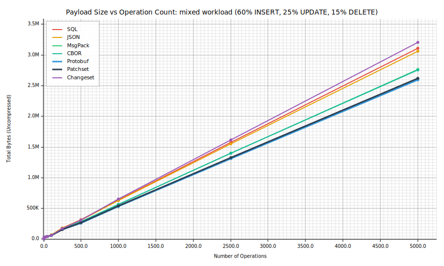

# payload-size-bench

Compares the wire size of seven serialization formats for identical database operations on a realistic chat schema. Each format uses the most natural binary encoding it supports, so the comparison reflects real-world usage rather than an artificial normalization.

| Format | Field IDs | Binary ID encoding | Ecosystem |
|---|---|---|---|
| **SQL** | Column names per row | Hex `X'...'` (32 chars) | Databases |
| **JSON** | Key strings per row | Hex string (32 chars) | Web APIs |
| **MsgPack** | Key strings per row | Raw bytes (16 bytes) | WebSocket/RPC |
| **CBOR** | Key strings per row | Raw bytes (16 bytes) | IoT/COSE |
| **Protobuf** | Field numbers (1 to 2 B) | Raw bytes (16 bytes) | gRPC/mobile |
| **Patchset** | Positional (header once) | Raw BLOB (16 bytes) | sqlite-diff |
| **Changeset** | Positional (header once) | Raw BLOB (16 bytes) | sqlite-diff |

```
cargo run -p payload-size-bench
```

## Schema under test

```sql
CREATE TABLE messages (
    id          BLOB PRIMARY KEY,  -- 16-byte UUID
    sender_id   BLOB NOT NULL,     -- 16-byte UUID
    receiver_id BLOB NOT NULL,     -- 16-byte UUID
    body        TEXT NOT NULL,
    created_at  TEXT NOT NULL
);
```

Message bodies are drawn from 10 realistic chat strings (4 to 140 bytes). UUIDs are deterministic 16-byte values.

## What it measures

The benchmark constructs identical logical operations in all seven formats and compares their serialized byte lengths. It does not measure CPU time, only payload size, which directly determines network bandwidth and storage cost.

Part 1 encodes each operation (INSERT, UPDATE, DELETE) once, standalone.

Part 2 shows the overhead breakdown for a single INSERT with a 124-byte body, comparing "raw content" (theoretical minimum, just data bytes with zero framing) to how much overhead each format adds.

Part 3 runs batches of 1 to 1,000 operations with a realistic mix (60% INSERT, 25% UPDATE, 15% DELETE). This is the key part of the benchmark because INSERTs are identical in patchset and changeset, UPDATEs diverge (changeset stores old and new, patchset only new), and DELETEs diverge (changeset stores all columns, patchset only the PK).

Part 4 reports per-operation amortized cost (total bytes divided by N), which shows how fixed headers amortize to near zero at scale.

Part 5 prints headline numbers at 1,000 operations.

## Results

### Single operations

| Operation | SQL | JSON | MsgPack | CBOR | Protobuf | Patchset | Changeset |
|---|--:|--:|--:|--:|--:|--:|--:|
| INSERT msg (4B body) | 223 | 205 | 136 | 134 | **88** | 104 | 104 |
| INSERT msg (124B body) | 343 | 325 | 257 | 255 | **209** | 224 | 224 |
| UPDATE body (4B to 40B) | 117 | 105 | 79 | 78 | **62** | 103 | 108 |
| DELETE message | 68 | 55 | 32 | 31 | **20** | 36 | 104 |

Protobuf wins every single operation. Field numbers instead of names plus raw bytes for UUIDs give the absolute minimum per-message framing. MsgPack and CBOR are close to each other since both carry key names but use raw byte-strings for UUIDs. Patchset and changeset are competitive on INSERT but pay a fixed table header of about 16 bytes that hurts on small single operations.

### Per-format overhead on a single INSERT (124B body)

| | Bytes | Overhead |
|---|--:|--:|
| Raw content | 196 | - |
| SQL | 343 | +75% |
| JSON | 325 | +66% |
| MsgPack | 257 | +31% |
| CBOR | 255 | +30% |
| Protobuf | 209 | +7% |
| Patchset | 224 | +14% |
| Changeset | 224 | +14% |

SQL repeats column names per row and wraps blobs in `X''` hex (twice the blob size), plus quotes and keywords. JSON pays for key names per row, hex-encoded blobs (twice the size), quotes, braces, and commas. MsgPack uses compact binary keys but still names them, and uses raw byte-strings for UUIDs. CBOR is similar to MsgPack with no quoting and lands about 2 bytes shorter. Protobuf uses field numbers (1 to 2 bytes each) instead of names, raw bytes for blobs, and varint length prefixes, which produces the lowest single-message overhead. Patchset and changeset emit the table header once (about 16 bytes), then each row carries an opcode and varint type tags per value.

### Mixed workload at scale (1,000 operations)

| Format | Total bytes | x raw | Overhead |
|---|--:|--:|--:|
| Raw content | 91,430 | 1.0x | - |
| SQL | 203,979 | 2.2x | +123% |
| JSON | 187,931 | 2.1x | +106% |
| MsgPack | 136,003 | 1.5x | +49% |
| CBOR | 134,463 | 1.5x | +47% |
| Changeset | 138,566 | 1.5x | +52% |
| **Patchset** | **106,996** | **1.2x** | **+17%** |
| **Protobuf** | **101,090** | **1.1x** | **+11%** |

### Patchset savings vs other formats

| vs | Saving |
|---|--:|
| SQL | **48%** |
| JSON | **43%** |
| MsgPack | **21%** |
| CBOR | **20%** |
| Changeset | **23%** |
| Protobuf | **-6%** (protobuf is smaller) |

### Per-operation amortized overhead (at 1,000 ops)

| Format | Overhead per op |
|---|--:|
| SQL | ~113 B |
| JSON | ~97 B |
| MsgPack | ~45 B |
| CBOR | ~43 B |
| Changeset | ~47 B |
| Patchset | ~16 B |
| **Protobuf** | **~10 B** |

## Analysis

### Why Protobuf wins at scale

Protobuf uses field numbers (1 to 2 bytes) instead of string key names, and varint length prefixes instead of delimiter-based framing. On a 5-column table this saves about 50 bytes per INSERT compared to CBOR or MsgPack, which repeat `"sender_id"`, `"receiver_id"`, and so on in every row. Combined with native `bytes` encoding for UUIDs, Protobuf reaches the absolute lowest overhead at about 10 bytes per operation.

### Why Patchset is close behind

Patchset applies the same insight as Protobuf: it does not repeat column identifiers per row. It uses a single table header (about 16 bytes for table name, column count, and PK flags), and each row is just an opcode, varint type tags, and the values. The remaining 6% gap to Protobuf comes from three things. Patchset emits a table name string while Protobuf uses numeric message types. Patchset uses SQLite's serial type encoding, which is a slightly different varint scheme. Protobuf's `OpBatch` wrapper encodes operation type via a 1-byte field number while patchset uses an opcode byte per row.

In practice the difference is small enough that patchset's advantage of being directly applicable to SQLite databases (no schema compilation, no `.proto` files) makes it the more practical choice for SQLite-based sync protocols.

### Why CBOR and MsgPack are close

Both formats support native byte-strings and have similar structural encoding. CBOR is about 1 to 2% smaller in this benchmark because its type prefixes are slightly more compact. In practice they are interchangeable for payload size.

### Why MsgPack and CBOR beat JSON

For the same logical data the binary formats save about 43% over JSON. They use raw byte-strings for UUIDs (16 bytes versus 32 hex chars), they drop quote characters around strings, and they use compact type prefixes instead of JSON delimiters.

### When Changeset costs more than Patchset

Changesets store old values alongside new values for UPDATEs, and all column values for DELETEs, so that conflict detection and reversal work. In a mixed workload with 25% UPDATEs and 15% DELETEs, this adds about 30% more bytes than patchset.

## Plot

Generated automatically by `cargo run -p payload-size-bench` (SVG in [plots/](plots/)).

The chart shows payload size vs operation count for a mixed workload (60% INSERT, 25% UPDATE, 15% DELETE) on the `messages` table.



All formats scale linearly, but SQL and JSON diverge upward fast because they repeat column names and hex-encode UUIDs on every row. Protobuf and patchset stay close to the raw-content baseline.

## Architecture

The benchmark is structured as a trait-based module system to minimize code redundancy.

```
src/
├── common.rs          # TestMessage, Format trait, test data generation
├── binary_serde.rs    # Shared serde structs for CBOR + MsgPack (byte-string IDs)
├── format_sql.rs      # SQL format
├── format_json.rs     # JSON format (hex-string IDs)
├── format_cbor.rs     # CBOR format (reuses binary_serde)
├── format_msgpack.rs  # MsgPack format (reuses binary_serde)
├── format_protobuf.rs # Protobuf format (hand-rolled encoding)
├── format_patchset.rs # Patchset format
├── format_changeset.rs# Changeset format (reuses patchset's build_insert)
├── plots.rs           # SVG chart generation (plotters, svg_backend)
└── main.rs            # Thin orchestrator + reporting + plot generation
```

Each format implements `trait Format { fn insert/update/delete/batch_mixed }`, and `main.rs` iterates over all formats generically. Adding a new format requires only implementing the trait in a new module.
